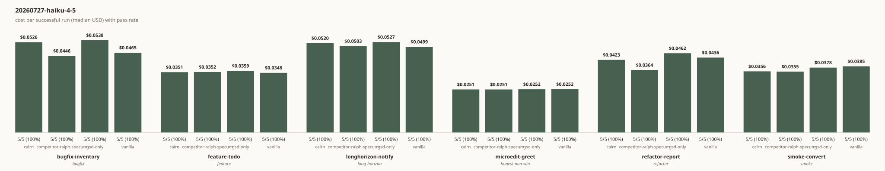
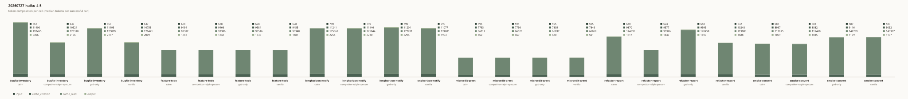

# Benchmarks

Public evidence for cairn's cost and outcome claims, methodology first.
Every mechanism that will ever produce a published number here is
documented, tested and committed before any number exists. The full
mechanics live in [benchmarks/README.md](benchmarks/README.md); this
document is the publication surface those mechanics regenerate.

## Methodology

**Harness.** Every measured run is one `bench-run.py` invocation of
`claude -p --output-format json`: one prompt, one schema-validated JSON
response, one appended JSONL row carrying cost, token usage, turn count,
error state and the verification outcome. Batches run through
`bench-matrix.py` with a seeded, reproducible interleaving of the full
`baseline × rep` cross-product, so no arm executes as a contiguous
cache-warm block; see
[randomized execution order](benchmarks/README.md#randomized-execution-order-bench-matrixpy).

**Environment isolation.** The measured claude subprocess never sees the
operator's machine: each run gets a fresh throwaway working copy of the task
fixture and a disposable scoped `HOME`, with an explicit minimal environment
that replaces (never merges with) the operator's. That empty `HOME` is what
removes the operator's CLAUDE.md, settings, MCP servers and hooks from the
measurement. It is worth an amount: the same trivial prompt cost 62k
cache-creation tokens under a real `HOME` and 33k under an isolated one.

Authentication runs one of two ways, stamped on every row as `auth_mode`. With
`ANTHROPIC_API_KEY` set, runs use `--bare`, which skips claude.ai OAuth
entirely. Without it, `CAIRN_BENCH_CREDENTIALS_FILE` seeds one credentials
file into the disposable `HOME` and `--bare` is dropped from every arm alike,
because it rejects file credentials outright. Only the credential travels;
nothing else from the operator's configuration does.

Isolation here is process-level, not a container. Runs execute as the invoking
user, so a sufficiently determined agent could reach outside its temporary
working directory by absolute path. Anthropic's own guidance for running with
relaxed permissions is a devcontainer, which this harness does not yet use.

**Permissions and turn cap.** Runs use `--permission-mode bypassPermissions`
so the agent can execute the fixture's tests. The alternative,
`acceptEdits`, denies Bash: a live run under it produced three permission
denials for test commands, which turns the benchmark into a test of one-shot
code writing and penalises exactly the arms whose value is plan, code, test,
fix. The turn cap is 30 for every arm. It was 8 until a live run consumed
8 of 8 on the trivial task with the leanest arm, which measures which
workflow fits the budget rather than which one solves the task.

**Baselines.** Four pinned manifests: `vanilla` (stock Claude Code, the
control arm), `gsd-only`, `cairn` (the full stack), and
`competitor-ralph-specum` (the strongest non-GSD competitor able to run
genuinely headless). `claude_flags` and the fully pinned model id are
byte-identical across all four; ONLY `provisioning.plugin_dirs` differs, so
any measured difference between arms is attributable to provisioning alone;
see [Baselines](benchmarks/README.md#baselines).

**Success gating.** A run counts as a pass only when `verify_passed` is
`true` AND `is_error` is falsy. The two axes are independent on real
captured rows (a run can hit the turn cap with the task already solved), so
a run that errored never counts as a success and never contributes to any
cost statistic; see
[Aggregation](benchmarks/README.md#aggregation-bench-aggregatepy).

**Task corpus.** Six tasks across six pre-declared categories (smoke,
bugfix, feature, refactor, honest-non-win, long-horizon), committed before
any comparative result exists. The `honest-non-win` category
(`microedit-greet`) is deliberate: cairn is expected to lose or tie on a
one-line edit, because a benchmark that shows only wins reads as
cherry-picked; see [Task corpus](benchmarks/README.md#task-corpus). The
default repetition count (5 per cell) is calibrated by the
[variance pilot](benchmarks/README.md#variance-pilot-corp-01) before the
full matrix ever runs.

**Cost.** The full matrix is `6 tasks × 4 arms × 5 reps = 120 runs`.
Summing the per-category upper-bound estimates with ~30% headroom gives the
declared ceiling for one full 120-run matrix pass: ~$40. The per-category
estimates, their derivation from the two real captured rows, and the
standing caveat that `total_cost_usd` is a client-side estimate (never
authoritative billing data) all live in the
[Cost model](benchmarks/README.md#cost-model).

## Raw data

The first full run landed 2026-07-27:
[benchmarks/results/matrix-20260727.jsonl](benchmarks/results/matrix-20260727.jsonl)
holds all 120 rows (6 tasks × 4 baselines × 5 repetitions, seed 20260727),
and [benchmarks/results/aggregated.json](benchmarks/results/aggregated.json)
is the aggregation this page's table and charts are generated from. Every run
cost $4.88 in total; none errored; all 120 passed their task's `verify.sh`.

Reproduce it with the command under [Reproduction](#reproduction), using the
same seed, manifests and fixtures.

Charts generated from that aggregation:





Two older rows also live in
[benchmarks/results/smoke-convert.jsonl](benchmarks/results/smoke-convert.jsonl),
captured 2026-07-25. They are schema-validation runs, not comparison results,
and are never counted toward any published comparison:

- they predate the `--baseline` flag becoming required, so neither row
  carries a `baseline_id`;
- they cover a single task with no repetition and no other arms, which
  cannot support any comparative statement;
- `bench-aggregate.py` in fact rejects both rows today for the missing
  `baseline_id` (a behavior pinned by `tests/bench-aggregate.bats`).

All future raw JSONL and every `aggregated.json` derived from it land under
`benchmarks/results/` and are committed alongside the results they back.

## Results

<!-- cairn:generated:benchmarks:start -->
Generated by bench-publish (20260727-haiku-4-5): do not edit between markers

| Task | Baseline | Category | Pass | Cost (median) |
|------|----------|----------|------|---------------|
| bugfix-inventory | cairn | bugfix | 5/5 (100%) | $0.0526 |
| bugfix-inventory | competitor-ralph-specum | bugfix | 5/5 (100%) | $0.0446 |
| bugfix-inventory | gsd-only | bugfix | 5/5 (100%) | $0.0538 |
| bugfix-inventory | vanilla | bugfix | 5/5 (100%) | $0.0465 |
| feature-todo | cairn | feature | 5/5 (100%) | $0.0351 |
| feature-todo | competitor-ralph-specum | feature | 5/5 (100%) | $0.0352 |
| feature-todo | gsd-only | feature | 5/5 (100%) | $0.0359 |
| feature-todo | vanilla | feature | 5/5 (100%) | $0.0348 |
| longhorizon-notify | cairn | long-horizon | 5/5 (100%) | $0.0520 |
| longhorizon-notify | competitor-ralph-specum | long-horizon | 5/5 (100%) | $0.0503 |
| longhorizon-notify | gsd-only | long-horizon | 5/5 (100%) | $0.0527 |
| longhorizon-notify | vanilla | long-horizon | 5/5 (100%) | $0.0499 |
| microedit-greet | cairn | honest-non-win | 5/5 (100%) | $0.0251 |
| microedit-greet | competitor-ralph-specum | honest-non-win | 5/5 (100%) | $0.0251 |
| microedit-greet | gsd-only | honest-non-win | 5/5 (100%) | $0.0252 |
| microedit-greet | vanilla | honest-non-win | 5/5 (100%) | $0.0252 |
| refactor-report | cairn | refactor | 5/5 (100%) | $0.0423 |
| refactor-report | competitor-ralph-specum | refactor | 5/5 (100%) | $0.0364 |
| refactor-report | gsd-only | refactor | 5/5 (100%) | $0.0462 |
| refactor-report | vanilla | refactor | 5/5 (100%) | $0.0436 |
| smoke-convert | cairn | smoke | 5/5 (100%) | $0.0356 |
| smoke-convert | competitor-ralph-specum | smoke | 5/5 (100%) | $0.0355 |
| smoke-convert | gsd-only | smoke | 5/5 (100%) | $0.0378 |
| smoke-convert | vanilla | smoke | 5/5 (100%) | $0.0385 |
<!-- cairn:generated:benchmarks:end -->

### What the numbers say

No arm is measurably cheaper than any other on this corpus. That includes
cairn, the plugin this repository ships.

The medians differ by a few tenths of a cent, and every per-cell range
overlaps. On `bugfix-inventory`, cairn spans $0.0467 to $0.0604 while vanilla
spans $0.0419 to $0.0530: five repetitions cannot separate distributions that
sit on top of each other like that. On `microedit-greet`, the category chosen
in advance as the one cairn should lose, all four arms land within a tenth of
a cent of $0.0251. Every arm passed every task, so pass rate contributes
nothing to the comparison either.

The honest reading is that this corpus is too small to test the claim. Each
task finishes in five to eleven turns and under a minute of wall clock. A
planning workflow has nothing to save on a job the bare agent gets right on
the first attempt. What cairn is built to avoid is the cost of rediscovering
context: work spread across phases and sessions, where a plan and a tracked
issue keep the next agent from re-reading the repository to figure out where
things stand. Converting Celsius to Fahrenheit has no context worth
preserving.

So this run says nothing about whether cairn saves tokens on real work. It
does establish three things worth keeping. The harness produces reproducible
numbers (120 runs, zero errors, zero rejected rows, $4.88). The measurement
does not favor the home team, since the plugin that owns this repository
placed third. And a corpus of short tasks cannot answer the question the
project set out to answer, which is a finding about the method rather than
about the tools.

Designing tasks that do exercise multi-session workflows is the next
milestone. Until those numbers exist, treat any efficiency claim about cairn,
including one made by this repository, as unproven.

## Reproduction

One command reproduces the full matrix:

```bash
benchmarks/scripts/bench-all.sh --yes
```

Without an explicit `--yes` the default is `--dry-run`: an always-safe, $0,
print-only mode that shows exactly what would run, never invokes any
downstream script, and never spends anything. The full 120-run matrix
carries the same declared cost ceiling as the Cost model above: ~$40.
Nothing runs live without explicitly accepting that ceiling first.

## Changelog

Every change to the corpus, the methodology, or the reproduction command
lands here as a dated entry, never as a silent edit after results exist.

- **2026-07-27**: first full matrix collected (120 runs, seed 20260727,
  claude-haiku-4-5-20251001, $4.88, `auth_mode: credentials` on all rows).
  Three methodology changes landed immediately before it, each forced by a
  live observation rather than by preference: the turn cap moved from 8 to 30
  after a run consumed 8 of 8 on the smallest task; `permission_mode` moved
  from `acceptEdits` to `bypassPermissions` after `acceptEdits` denied the
  agent its own test commands; and `--bare` became conditional on the
  authentication mode after file credentials proved incompatible with it. All
  three apply identically to every arm.
- **2026-07-26**: task corpus pre-declared and committed (6 tasks across 6
  categories, including the deliberate honest-non-win task
  `microedit-greet`) before any comparative result exists.
- **2026-07-26**: this document created: methodology, raw-data labeling,
  generated Results section (explicitly pending first collection),
  reproduction command and cost ceiling.
