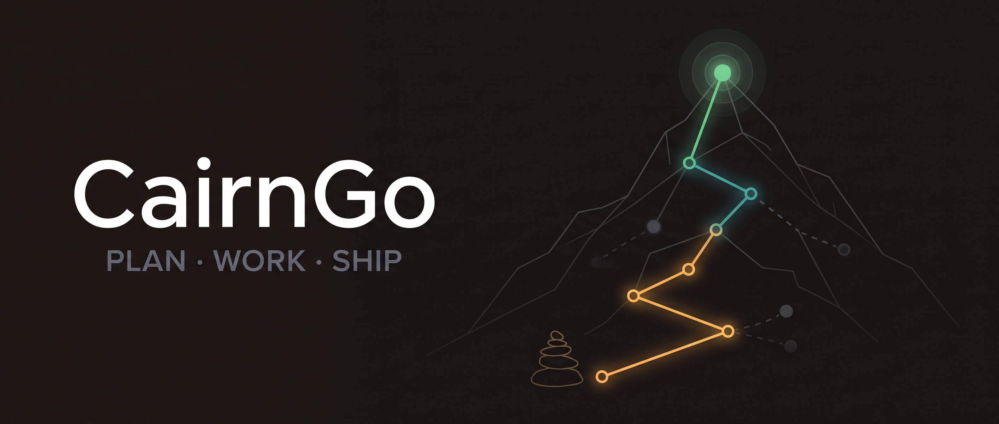

# Cairn



> *A cairn is a stack of stones that marks a trail — and remembers the path you
> took. This plugin does the same for a project: it stacks **plan → work →
> memory** into one marker so a solo build stays on-trail.*

**Cairn is a [Claude Code](https://docs.anthropic.com/en/docs/claude-code) plugin**
that fuses the [GSD](https://github.com/jnuyens/gsd-plugin) planning workflow
(`/gsd:*`, `.planning/`), the [beads](https://github.com/gastownhall/beads)
issue tracker (`bd`, `.beads/`), and
[context-mode](https://github.com/mksglu/context-mode) memory (`ctx_*`) into
**one lifecycle**: planning creates tracked issues, execution claims and closes
them, shipping is gated on the tracker, and compressed memory is scoped to the
issue you are actually working on. Cairn forks none of the three — it installs
the machinery (a GSD capability, Claude Code hooks, a git pre-push gate) that
makes them behave as a single tool.

## How it feels

You run the loop you already know — plain `/gsd:*`, or the `/cairn:*` verbs —
and tracking happens invisibly:

```text
/gsd:plan-phase 3       # plans link issues: beads: frontmatter set, phase map regenerated
/gsd:execute-phase 3    # each plan's issues claimed at wave start, closed with a summary on completion
/gsd:ship               # gated: blocked while the phase still has non-closed issues
```

No `bd` invocations to remember, no status tables to maintain by hand. The
tracker fills itself in as the plan advances, and `/cairn:status` (driven by
`bd ready`) tells you the one next action.

## Install

> **Cross-marketplace dependency — read this first.** cairn depends on
> [context-mode](https://github.com/mksglu/context-mode), which lives in its
> **own** `context-mode` marketplace. Add that marketplace too, otherwise the
> dependency stays unresolved and cairn is disabled until you do.

```text
/plugin marketplace add mksglu/context-mode    # the context-mode dependency lives here
/plugin marketplace add FelipeOFF/CairnGo
/plugin install cairn@cairngo                  # GSD installs with it (declared dependency)
```

- **GSD** installs automatically — it is re-published in this marketplace as a
  pointer to its upstream (`jnuyens/gsd-plugin`), so it stays a clean
  same-marketplace dependency without being forked.
- **beads** (`bd`) is a binary, not a plugin, so cairn offers to install it on
  your first session. Manual install: `brew install beads` ·
  `npm install -g @beads/bd`.

Then, in the repo you want wired:

```text
/cairn:init
```

`/cairn:init` detects the repo's state before touching anything. Greenfield →
it wires git + `bd init`, installs the GSD capability project-scope, and hands
off to the interactive `/gsd:new-project`. A repo with existing `.planning/`
or `.beads/` history → it stops and routes to `/cairn:migrate` (next section)
instead of re-interviewing you.

## Already using GSD or beads? Start here

`/cairn:migrate` adopts an existing repo without losing history. It detects
which of four states the repo is in and builds the matching plan:

| State | You have | What migration does |
|---|---|---|
| **A** — GSD-only | `.planning/`, no `.beads/` | **Backfill**: one epic per roadmap phase (+ phase deps), one stamped issue per requirement; completed phases become *closed* issues, `beads:` frontmatter is appended to plans, maps are generated |
| **B** — beads-only | `.beads/`, no `.planning/` | **Bootstrap**: epics (or topological layers of the dependency graph) become proposed phases — you confirm the grouping before anything is written — and REQUIREMENTS / ROADMAP / STATE are generated from the issues |
| **C** — both, unwired | both dirs, no stamps or maps | **Reconcile**: exact `CAT-NN` title matches link automatically, fuzzy matches only with your per-item confirmation, orphan issues listed for you to route |
| **W** — wired | both, already stamped | Nothing to migrate — run `/cairn:doctor` instead |

What it will **never** do: run `/gsd:new-project` over an existing
`.planning/` — no re-interview, no clobbered setup. Every mode is **dry-run
first** (the full plan of creates, closes, labels, and writes is shown before
a single mutation) and **idempotent**: already-adopted issues are updated, not
recreated (the `gsd` metadata stamp is the dedup key), and an interrupted run
resumes from the journal at `.cairn/migrate-state.json`.

**📖 Full guide:** [`docs/migration.md`](./docs/migration.md)

## What the fusion is made of

Four layers, ordered from "enforced by machinery" down to "enforced by
convention":

| Layer | Where | What it guarantees |
|---|---|---|
| **GSD capability** | `.gsd/capabilities/cairn/` (installed by `/cairn:init`) | plain `/gsd:*` drives beads: `plan:post` writes `beads:` frontmatter + regenerates the map, `execute:wave:pre` claims, `execute:wave:post` closes with a SUMMARY-derived reason, `verify:post` cross-checks, and `ship:pre` is a **blocking, deterministic gate** |
| **Claude Code hooks** | `hooks/` | SessionStart injects context + migration nudges; PostToolUse on `bd create/update/close` fires the sync mirror push + phase-map refresh; Stop warns about claims left `in_progress` |
| **git pre-push gate** | `.git/hooks/pre-push` (chainable shim installed by `cairn-init.sh`) | the ship gate holds with no LLM in the loop: a push with non-closed issues in a completed phase fails |
| **Conventions** | `skills/` | the same rules in prose — the fallback layer every runtime gets |

The data model underneath (bd is the machine-readable source of truth):

- **Pair labels** — every managed issue carries `m-<milestone>` + `phase-<N>`;
  the milestone label disambiguates phase numbers that repeat across
  milestones (`bd list -l m-v1.0,phase-3` — a comma list is AND).
- **Metadata stamp** — every managed issue carries
  `{"gsd": {"req", "phase", "milestone", "plan"}}`; `(gsd.req, gsd.milestone)`
  is the dedup key, so re-runs update instead of duplicating.
- **Generated maps** — each phase's `NN-BEADS-MAP.md` is rendered from
  `bd list --json` between `<!-- cairn:generated -->` markers; notes outside
  the markers survive regeneration.
- **Plan frontmatter** — every `PLAN.md` lists the bd ids it advances
  (`beads: [ids]`); that list is what claim and close operate on.
- **Precedence** — when an issue's text conflicts with GSD phase docs, the GSD
  doc wins; the issue is updated with a dated reconciliation note.

Drift never accumulates invisibly: **`/cairn:doctor`** is a nine-check
deterministic audit (requirement ↔ issue ↔ map ↔ frontmatter, superseded
plans, orphans, label pairs, stale claims, plus `bd doctor` delegation) with a
`--fix-labels` repair.

## Version floor

- **beads ≥ 1.1.0** — check with `bd version`. The metadata-merge and
  bulk-create behavior cairn relies on lands in 1.1.0.
- **GSD ≥ 1.8.0** — pinned by the capability's `engines.gsd`; GSD itself
  installs from upstream as a plugin dependency.
- **Enforcement is Claude Code-only** — the capability, hooks, and pre-push
  shim are Claude Code plugin machinery; other GSD runtimes get the
  conventions (the skills), not the enforcement.

## One interface — `/cairn:`

You don't have to remember whether a thing is a `bd` command or a `/gsd:*`
command. `/cairn:` is a single namespace over all three tools; each workflow
verb runs the combined GSD+beads lifecycle. `/cairn:help` prints this map.

```text
SETUP
  /cairn:init             ensure GSD + beads, wire git + bd init, then hand off
  /cairn:new              new project: /gsd:new-project + stamped bd issues + generated maps

LOOP
  /cairn:plan  <N>        plan phase N  (GSD plan-phase + regenerate/reconcile beads map)
  /cairn:work  <N>        execute phase N  (claim → execute → close per plan)
  /cairn:quick <desc>     tracked side-quest: stamped quick issue (discovered-from) + GSD quick
  /cairn:verify <N>       verify phase N  (GSD verify-work × beads cross-check)
  /cairn:ship             gate on all phase issues closed, then GSD ship / push
  /cairn:milestone <op>   new: roadmap + issues + maps · complete: gate → reconcile → archive

VIEW
  /cairn:status           bd-ready-driven: actionable / in-flight / blocked + one next action
  /cairn:progress         roadmap-level progress (GSD)
  /cairn:issues [N]       list beads issues, optionally scoped to phase N

MIGRATE & HEALTH
  /cairn:migrate          adopt an existing repo (GSD-only, beads-only, or both
                          unwired): detect → dry-run plan → confirm → apply
  /cairn:doctor           consistency checks (req↔issue, frontmatter ids, map
                          freshness, label pairs) + --fix-labels repair

MEMORY (context-mode — on by default)
  /cairn:remember [what]  index reference material under the active gb/<id>/<phase>
  /cairn:recall  <query>  search memory scoped to the active issue + phase
  /cairn:context-config   (optional) tune the scope template / capacity threshold

SYNC (optional)
  /cairn:sync-config      mirror bd ↔ GitHub/GitLab/Jira/Asana/Azure Boards
  /cairn:sync-pull        reconcile external edits back into bd

ESCAPE HATCHES (raw passthrough — reach anything the verbs don't wrap)
  /cairn:bd  <args…>      run any beads command   (e.g. /cairn:bd dep add a b)
  /cairn:gsd <cmd> [args] run any GSD command      (e.g. /cairn:gsd debug)
  /cairn:ctx <op> [args]  run any context-mode op  (e.g. /cairn:ctx stats)
```

The verbs are a curated facade, not a full mirror — the three passthroughs
(`/cairn:bd`, `/cairn:gsd`, `/cairn:ctx`) reach anything a verb doesn't wrap,
so the whole of beads, GSD, and context-mode stays one keystroke away without
cairn drifting as they change.

## Two-way sync to external tools (optional)

Mirror bd issues to **GitHub Issues, GitLab, Jira, Asana, and/or Azure
Boards** — hub-and-spoke, with bd as the source of truth. PUSH fires
automatically after every bd lifecycle write (the PostToolUse hook); PULL is
on-demand:

```text
/cairn:sync-config     # pick backends, write .cairn/sync.json
/cairn:sync-pull       # reconcile external edits back into bd (last-writer-wins)
```

Each backend is a small adapter in `adapters/` implementing a stdin/stdout
contract (`adapters/_contract.md`) — add another tool by dropping in one
adapter and a `sync.json` block, no dispatcher changes. API tokens are
referenced by environment-variable name only; no secrets ever touch the repo.

**📖 Full guide:** [`docs/sync.md`](./docs/sync.md)

## Intent-aware memory (context-mode)

context-mode ships as a dependency, so this is on by default. Cairn scopes its
compressed memory to the **active bd issue + GSD phase**: `/cairn:remember`
indexes under `gb/<id>/<phase>`, `/cairn:recall` searches only that scope, the
scope switches when the phase does, and a capacity guard suggests splitting
the active issue into sub-tasks before the context window degrades. This layer
never deletes the knowledge base — any real wipe stays a manual, user-confirmed
action. Tuning is optional: `/cairn:context-config`.

**📖 Full guide:** [`docs/context.md`](./docs/context.md) · how all the pieces
fit: [`docs/architecture.md`](./docs/architecture.md)

## Components

| Path | Purpose |
|---|---|
| `skills/cairn/SKILL.md` | the GSD↔beads integration convention (the fallback layer) |
| `skills/cairn-sync/SKILL.md` | the bd ↔ external-tools sync convention |
| `skills/cairn-context/SKILL.md` | the context-mode intent-aware memory convention |
| `capability/capability.json` | the GSD capability manifest — loop contributions + the blocking `ship:pre` gate |
| `capability/fragments/*.md` | prompt fragments for `plan:post`, `execute:wave:pre/post`, `verify:post` |
| `capability/scripts/` | the bundled deterministic loop gate (`cairn-loop-gate`) + map wrapper |
| `commands/init.md` · `new.md` | setup: detect-and-route init, new project with stamped issues |
| `commands/plan.md` · `work.md` · `quick.md` · `verify.md` · `ship.md` · `milestone.md` | the loop verbs |
| `commands/status.md` · `progress.md` · `issues.md` | views over beads + GSD state |
| `commands/migrate.md` · `doctor.md` | adoption + health |
| `commands/remember.md` · `recall.md` · `context-config.md` | the memory verbs |
| `commands/sync-config.md` · `sync-pull.md` | the sync verbs |
| `commands/bd.md` · `gsd.md` · `ctx.md` | raw passthroughs to `bd` / `/gsd:*` / `ctx_*` |
| `commands/help.md` | prints the verb map above |
| `hooks/hooks.json` | hook registration (SessionStart · PostToolUse · Stop) |
| `hooks/session-start.sh` | context injection + migration nudges |
| `hooks/post-bd-write.sh` | mirror push + phase-map refresh after `bd create/update/close` |
| `hooks/session-stop.sh` | end-of-session warning for stale `in_progress` claims |
| `scripts/cairn-init.sh` | bootstrap: git + `bd init` + pre-push shim + `.cairn` gitignore entries |
| `scripts/cairn-map.py` / `.sh` | generate `NN-BEADS-MAP.md` from bd state |
| `scripts/cairn-relabel.py` / `.sh` | milestone label pairing + phase renumbering |
| `scripts/cairn-gate.py` / `.sh` | the ship gate (also run by the git pre-push shim) |
| `scripts/cairn-migrate.py` / `.sh` | the migration engine: detect / plan / apply |
| `scripts/cairn-doctor.py` / `.sh` | the nine-check consistency audit |
| `scripts/gbsync.py` / `.sh` | the push/pull sync dispatcher |
| `adapters/*.py` · `_contract.md` | github · gitlab · jira · asana · azure-boards adapters + the interface spec |
| `templates/*.example` | starter `sync.json` / `context.json` |
| `docs/` | deep dives: migration · sync · context-mode memory · architecture |

Tests live at the repo root (`tests/`, bats) and run the deterministic scripts
against fixture repos with a real `bd` — see `tests/README.md`.

## Origin & license

Cairn began as [cairn](https://github.com/eventually-consistent-code/claude-plugins)
by John Reed (eventually-consistent-code); this fork carries that design
forward into a GSD capability with deterministic enforcement and migration.

MIT — see [LICENSE](./LICENSE). Cairn runs entirely on your machine and
collects nothing; the only outbound traffic is the sync you explicitly
configure, with your own credentials ([PRIVACY.md](./PRIVACY.md)).
