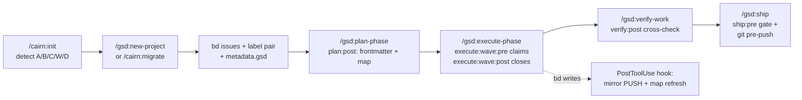

# Cairn architecture — one lifecycle over three tools

> **v5:** slash commands are hyphenated (`/cairn-init`, `/cairn-implement`).
> Claude Code also registers `/cairn:cairn-init`. Names like `/cairn:plan` and
> `/cairn:migrate` below are historical (pre-5.0). See [commands.md](./commands.md).

> This document explains how cairn fuses GSD (planning), beads (issue tracking)
> and context-mode (memory) into a single workflow: what owns which data, what
> is enforced by code versus followed by convention, and where each moving part
> lives. Read this before changing any integration surface.

## The one-sentence model

**GSD owns the plan, beads owns the work items, context-mode owns the memory —
and cairn makes the three move as one lifecycle, enforced by a GSD capability,
Claude Code hooks, a git pre-push gate, and generated (never hand-maintained)
linking artifacts.**

## Ownership and source of truth

| Data | Owner | Machine-readable source of truth | Human view |
|---|---|---|---|
| Roadmap, phases, requirements, plans | GSD | `.planning/*.md`, parsed leniently by the cairn scripts (ROADMAP checkboxes / progress tables, STATE.md frontmatter) | `.planning/*.md` |
| Work items, status, dependencies, history | beads | `bd … --json` (never read `.beads/` files directly) | `bd list`, `bd show` |
| Requirement ↔ issue linkage | cairn | `metadata.gsd` stamped on every issue | `NN-BEADS-MAP.md` (generated) |
| Compressed session memory | context-mode | `ctx_*` tools, source labels `gb/<bd_id>/<phase>` | `/cairn:recall` |
| Sync mirror state | cairn | `.cairn/id-map.json`, `.cairn/state.json` | `.cairn/conflicts.json` |

Two rules fall out of this table:

1. **The map is a view, not a source.** Every `NN-BEADS-MAP.md` is regenerated
   from `bd list … --json` between the `<!-- cairn:generated:start -->` /
   `<!-- cairn:generated:end -->` markers. If a map and `bd` disagree, the map
   is stale — regenerate it (`cairn-map.sh <N>`; `--check` exits 3 with a diff
   when it is stale). Never edit inside the markers; manual notes outside them
   survive regeneration.
2. **Precedence on semantic conflict:** GSD phase docs (CONTEXT.md, PLAN.md,
   ROADMAP.md) win over bd issue *text* — the issue gets updated with a dated
   ⚠ reconciliation note, never silently followed. bd wins on *status*: an
   issue's open/closed state is operational truth, which is exactly why the
   map is generated from bd and never maintained by hand.

## The linking contract

Every issue cairn creates or adopts carries:

```json
{
  "metadata": {
    "gsd": {
      "req": "AUTH-01",       // requirement ID from REQUIREMENTS.md
      "phase": 3,              // unpadded phase number
      "milestone": "v1.0",     // ROADMAP milestone
      "plan": "03-02"          // NN-PP plan id, once planned (optional)
    }
  }
}
```

- The pair (`gsd.req`, `gsd.milestone`) is the **dedup/idempotency key** for
  migration and backfill: re-runs update instead of recreate.
- Labels: every issue gets the **pair** `m-<milestone>` + `phase-<N>`
  (unpadded — `phase-3`, never `phase-03`). `bd list -l` uses AND semantics,
  so `bd list -l m-v1.0,phase-3` scopes exactly. The pair exists because
  phase numbers alone collide across milestones and would corrupt the ship
  gate. Legacy repos whose issues carry only `phase-N` get paired once via
  `cairn-relabel.sh pair --milestone <m>` (or `/cairn:doctor --fix-labels`).
- Plans link back with `beads: [ids]` frontmatter, written at plan time and
  validated by `/cairn:doctor`.
- Stamp updates are **read-modify-write**: `bd update --metadata` replaces the
  whole `gsd` object, so read it back from `bd show <id> --json`, change the
  one field, write the full object back.

## Enforcement layers (what is code, what is convention)

From strongest to weakest:

1. **GSD capability** (`.gsd/capabilities/cairn/`, staged at project scope by
   `/cairn:init`) — the sanctioned extension point. Activation key
   `cairn.enabled`; compatibility pinned by `engines.gsd` (`>=1.8.0`) in the
   manifest — the only real version pin available between plugins. It hooks
   the loop at:
   - `plan:post` — resolve each PLAN.md's requirements against the phase's bd
     issues, write `beads:` frontmatter, regenerate `NN-BEADS-MAP.md`
   - `execute:wave:pre` — `bd update --claim` every id in the dispatched
     plan's `beads:` frontmatter. (Wave-level on purpose: `execute:pre` is
     declared in the loop-host contract but never dispatched by the
     execute-phase workflow today.)
   - `execute:wave:post` — `bd close --reason` with a one-line SUMMARY
     digest, then refresh the map
   - `verify:post` — cross-check bd open state against the VERIFICATION
     report
   - `ship:pre` — **blocking** gate: zero **non-closed** issues (any status
     other than `closed` — open, in_progress, blocked, deferred) labeled
     `phase-<N>` for any completed phase. The check is a `command-exit-zero`
     **predicate** running the bundled `cairn-loop-gate.sh ship-gate`
     (ADR-2008): GSD's check-command-router only routes first-party query
     ids, and the predicate form is what lets a third-party capability keep
     the gate blocking AND deterministic.
   All bundled scripts no-op cleanly (exit 0, silent) when `.beads/` or
   `.planning/` is absent or `cairn.enabled` is false, so GSD behaves
   untouched in non-beads repos.
2. **Claude Code hooks** (`cairn/hooks/`) —
   - `PostToolUse` (matcher `Bash`): the script itself matches
     `^bd (create|update|close)`, then fires two fire-and-forget background
     jobs — a mirror PUSH via gbsync (a `create` triggers a full push of
     unmapped ids) and a phase-map refresh when the command mentions
     `phase-<N>`. Always exits 0; never fails the tool call.
   - `SessionStart` (`startup|clear|compact`): offer to install `bd` when the
     binary is missing, nudge `/cairn:migrate` for unwired or half-wired
     repos, and inject the convention reminder when both dirs are present.
   - `Stop`: warn about in_progress issues still assigned to the current
     actor (`$BEADS_ACTOR`, else git `user.name`, else `$USER`).
3. **git hook** — the `pre-push` shim installed by `cairn-init.sh` re-runs
   `cairn-gate.sh` outside any LLM. Chainable (a pre-existing hook is moved
   to `pre-push.old` and runs first); blocks ONLY on gate exit 6 — exit 5
   (bd unavailable) warns and lets the push through, because an availability
   failure is not a gate failure.
4. **Prose conventions** (`cairn/skills/*/SKILL.md`, `cairn/commands/*.md`) —
   everything else. Even here the prose delegates: `/cairn:ship` and
   `/cairn:milestone complete` run `cairn-gate.sh` before anything moves,
   `/cairn:quick` keeps side-quests stamped (`quick` label +
   `discovered-from` provenance), and `/cairn:status` is driven by
   `bd ready --json`. Prose is the last resort, never the mechanism for
   anything a script can check.

The historical failure mode of cairn was doing all four levels with #4 only.
New work must justify itself if it lands below level 2.

## Lifecycle walk-through



The user only ever needs `/gsd:*` — the installed capability makes plain GSD
do the beads bookkeeping — or the curated `/cairn:*` verbs: same lifecycle,
fused view. Work discovered mid-phase goes through `/cairn:quick` (tracked,
unphased, `discovered-from` the active issue); milestone rollover goes through
`/cairn:milestone` (`new`: roadmap + stamped issues + maps; `complete`:
gate → reconcile → archive → compact). beads bookkeeping is a side effect,
not a chore.

## Migration modes (detection is step 0 of init)

| Mode | Detected state | Action |
|---|---|---|
| A | `.planning/` only | Backfill: one epic per phase (+ roadmap deps), one stamped child issue per requirement, completed phases closed, maps generated, `beads:` frontmatter appended, stray todos adopted |
| B | `.beads/` only | Bootstrap: epics (or topological layers) → phases, confirmed interactively; REQUIREMENTS/ROADMAP/STATE + MILESTONES.md generated; PROJECT.md via a short seeded interview |
| C | both, unwired | Reconcile: exact `CAT-NN` title match auto, fuzzy matches user-confirmed, orphans user-routed, divergence report |
| W | both, already wired | Nothing to migrate — `/cairn:doctor` instead |
| D | neither | Greenfield: the classic `/cairn:init` flow |

Invariants for every mode: `detect → plan → confirm → apply`, with `plan`
read-only (it writes only `.cairn/migrate-plan.json` and prints the full
dry-run); a JSONL journal in `.cairn/migrate-state.json` (resume, never
duplicate); idempotency via the metadata dedup key AND live-bd-state checks in
every write handler; sensitive steps (closing pre-existing issues, fuzzy
links) held as `pending_confirmation` in the plan file until the user
confirms; issue creation is **sequential `bd create`**, not `bd create
--graph` (bd 1.1.0 stores `--graph` node metadata as a string, which would
break the queryable `metadata.gsd` contract); mirror pushes never fire mid-run
(the engine's bd writes sit below the PostToolUse hook's `^bd` matcher) — one
`/cairn:sync-pull` after; and **never** run `/gsd:new-project` when
`.planning/` exists.

See `docs/migration.md` for the user-facing guide.

## Health: /cairn:doctor

`cairn-doctor.py` cross-checks the two sources of truth and reports drift.
Read-only except `--fix-labels`, which delegates to `cairn-relabel.py pair`
(refused when the active milestone is unresolvable). Nine checks: a bd
minimum-version probe, req↔issue coverage, `beads:` frontmatter ids, map
freshness, superseded-plan ids still open, orphans (unphased non-closed
issues — the `migrated-todo`, `backlog` and `quick` labels are exempt),
label pairs, stale claims, and a `bd doctor` passthrough. Exit codes: 0 ok or ok+warnings, 2 usage / `--fix-labels`
refused, 5 bd unavailable, 7 at least one check failed.

## Testing seam

One seam: every deterministic behavior is a CLI script under `cairn/scripts/`
(or the capability bundle's `capability/scripts/`), tested by bats against
disposable fixture repos (real `bd`, skipped when absent). Prose commands are
thin wrappers over those scripts and are not tested directly. See
`tests/README.md`.

The vendored GSD runtime is the one seam with a second, stricter layer: its
Python dispatcher is compared byte-for-byte against the pinned upstream binary
by a golden harness, with every deliberate difference declared. See
[the vendored GSD runtime](./gsd-runtime.md).

## Version compatibility

- **beads:** all access goes through the `bd` CLI with `--json`; `.beads/`
  internals are never an integration surface. Known version quirks are
  pinned in code where they bit: `bd create --graph` flattens nested
  metadata (hence the migration engine's sequential creates), and
  `bd update --metadata` replaces each provided key wholesale (hence
  read-modify-write everywhere). `/cairn:doctor`'s last check delegates to
  `bd doctor` itself.
- **GSD:** pinned via `engines.gsd` (`>=1.8.0`) in the capability manifest;
  install/load fails fast on incompatible versions. Everything else parses
  `.planning/` markdown leniently rather than binding to GSD internals.
- **context-mode:** reached only through the `ctx_*` tools, scope-by-label
  only — cairn never calls `ctx_purge` (a manual, user-confirmed action).
